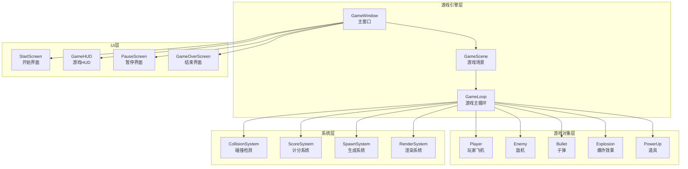
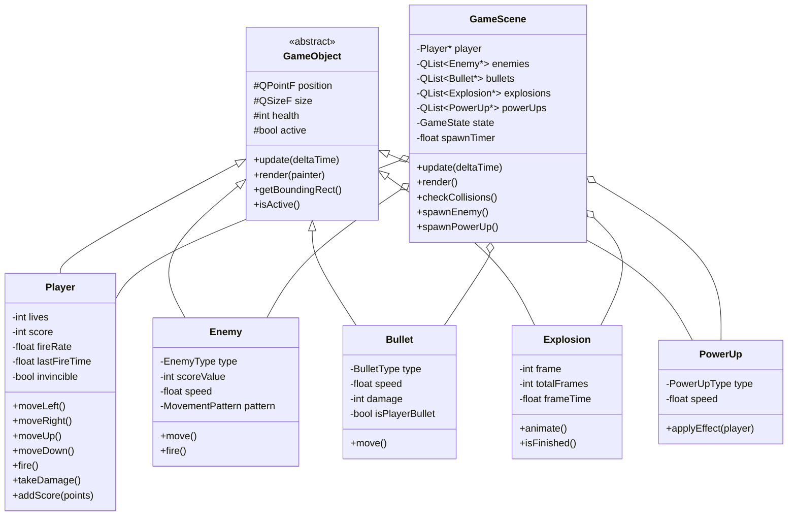
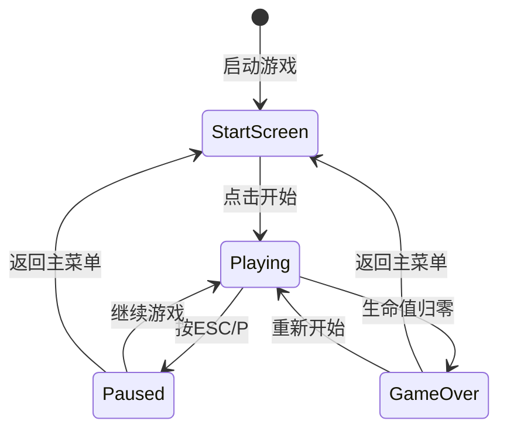

# 飞机大战游戏 - 项目设计文档

## 1. 系统架构



## 2. 类图设计



## 3. 游戏状态流转



## 4. 功能模块

### 4.1 玩家系统
| 功能 | 描述 |
|------|------|
| 移动控制 | WASD / 方向键控制飞机移动 |
| 射击 | 空格键发射子弹，支持自动射击 |
| 生命系统 | 初始3条命，被击中后短暂无敌 |
| 分数系统 | 击毁敌机获得分数 |

### 4.2 敌机系统
| 敌机类型 | 血量 | 分数 | 特点 |
|----------|------|------|------|
| 小型机 | 1 | 100 | 速度快，直线移动 |
| 中型机 | 3 | 300 | 中速，左右摇摆 |
| 大型机 | 10 | 1000 | 速度慢，会发射子弹 |
| Boss | 50 | 5000 | 阶段性出现，多种攻击模式 |

### 4.3 道具系统
| 道具类型 | 效果 |
|----------|------|
| 生命+1 | 增加一条生命 |
| 火力增强 | 临时提升火力（双发/三发） |
| 护盾 | 5秒无敌时间 |
| 炸弹 | 清屏所有敌机 |

### 4.4 关卡设计
- 每击杀100个敌人进入下一关
- 每关敌机速度和生成频率增加10%
- 每5关出现一次Boss

## 5. UI/UX 规范

### 5.1 色彩规范
| 元素 | 颜色值 | 说明 |
|------|--------|------|
| 主色调 | #1A1A2E | 深蓝色背景 |
| 强调色 | #E94560 | 红色，用于危险/敌机 |
| 辅助色 | #0F3460 | 蓝色，用于玩家 |
| 高亮色 | #FFD93D | 金色，用于分数/道具 |
| 文字色 | #EAEAEA | 浅灰色文字 |

### 5.2 字体规范
- 标题：24px Bold
- 正文：16px Regular
- 数字：18px Monospace

### 5.3 动画规范
- 帧率：60 FPS
- 爆炸动画：8帧，120ms
- 无敌闪烁：100ms间隔
- 界面过渡：300ms淡入淡出

## 6. 技术规格

### 6.1 开发环境
- Qt 6.5+
- C++ 17
- CMake 3.16+

### 6.2 性能目标
- 稳定60FPS
- 内存占用 < 100MB
- 支持同屏100+游戏对象

### 6.3 平台支持
- Windows 10/11
- macOS 12+
- Linux (Ubuntu 22.04+)

## 7. 文件结构

```
game/
├── CMakeLists.txt          # 构建配置
├── Dockerfile              # Docker构建文件
├── main.cpp                # 程序入口
├── resources/
│   └── resources.qrc       # Qt资源文件
└── src/
    ├── config/
    │   └── GameConfig.h    # 游戏配置常量
    ├── core/
    │   ├── GameObject.h    # 游戏对象基类
    │   ├── GameScene.h/cpp # 游戏场景
    │   └── GameWindow.h/cpp# 主窗口
    ├── entities/
    │   ├── Player.h/cpp    # 玩家
    │   ├── Enemy.h/cpp     # 敌机
    │   ├── Bullet.h/cpp    # 子弹
    │   ├── Explosion.h/cpp # 爆炸
    │   └── PowerUp.h/cpp   # 道具
    └── ui/
        ├── StartScreen.h/cpp   # 开始界面
        ├── GameHUD.h/cpp       # 游戏HUD
        ├── PauseScreen.h/cpp   # 暂停界面
        └── GameOverScreen.h/cpp# 结束界面
```

## 8. 键位说明

| 按键 | 功能 |
|------|------|
| W / ↑ | 向上移动 |
| S / ↓ | 向下移动 |
| A / ← | 向左移动 |
| D / → | 向右移动 |
| 空格 | 发射子弹 |
| ESC / P | 暂停游戏 |
| B | 使用炸弹 |
| Enter | 确认/开始 |
